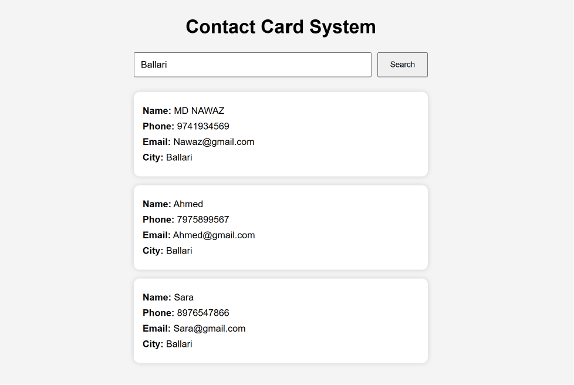
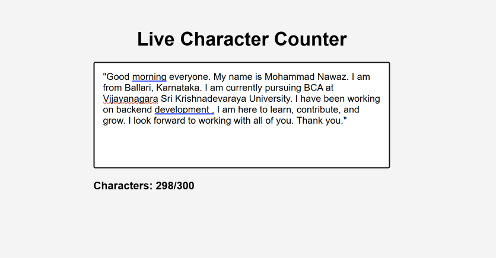
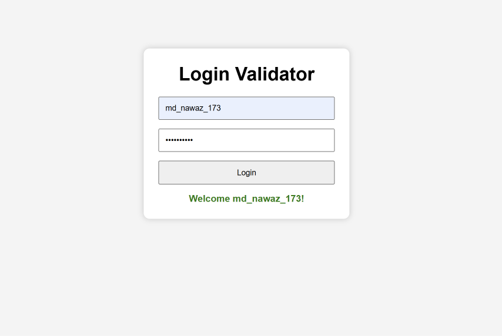
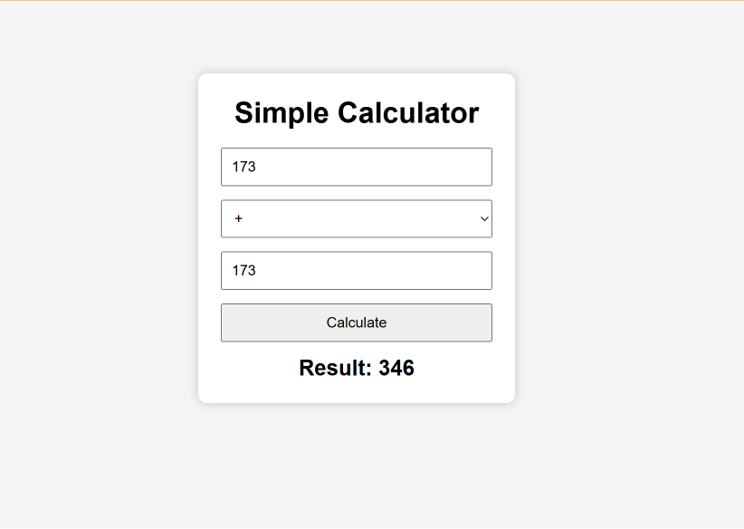
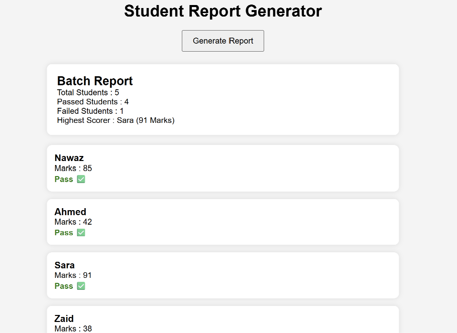

# Day 10 - JavaScript Mini Projects

A collection of JavaScript mini projects built to strengthen problem-solving, DOM manipulation, asynchronous programming, and Object-Oriented Programming (OOP). Each project focuses on applying JavaScript concepts through practical, interactive examples.

## 📸 Preview

> Add screenshots of each mini project here.

### 1. Contact Card System

### 2. Library Book System
This is a JavaScript logic-based project and does not have a graphical user interface.

### 3. Live Character Counter

### 4. Login Validator

### 5. Processing Pipeline
This is a JavaScript logic-based project and does not have a graphical user interface.

### 6. Simple Calculator

### 7. Student Report Generator

### 8. Random User Card

---

## ✨ Mini Projects Included

- 📇 Contact Card System
- 📚 Library Book System
- ✍️ Live Character Counter
- 🔐 Login Validator
- 🔄 Processing Pipeline
- 🧮 Simple Calculator
- 🎓 Student Report Generator
- 🌤️ Weather Card

---

## 🚀 Features

### 📇 Contact Card System
- Search contacts by city
- Display contact information as cards
- Uses arrays, objects, filter(), and DOM manipulation

### 📚 Library Book System
- Add books to the library
- Check out and return books
- Display available books
- Built using JavaScript Classes and OOP concepts

### ✍️ Live Character Counter
- Real-time character counting
- Changes counter color after exceeding the limit
- Uses input events and DOM manipulation

### 🔐 Login Validator
- Username validation
- Password validation
- Trims whitespace
- Converts username to lowercase

### 🔄 Processing Pipeline
- Demonstrates Higher-Order Functions
- Function composition using `pipe()`
- Processes data step by step

### 🧮 Simple Calculator
- Perform Addition
- Subtraction
- Multiplication
- Division
- Handles division by zero

### 🎓 Student Report Generator
- Total students
- Passed and failed count
- Highest scorer
- Individual result cards

### 🌤️ Weather Card
- Fetches user data from JSONPlaceholder API
- Displays user details in a styled card
- Uses Fetch API and Async/Await

---

## 🛠️ Tech Stack

- HTML5
- CSS3
- JavaScript (ES6+)
- Fetch API
- Object-Oriented Programming (OOP)

---

## 📌 What I Learned

- DOM Manipulation
- Event Listeners
- Form Validation
- Fetch API
- Async/Await
- Error Handling
- JavaScript Classes
- Objects & Arrays
- Higher-Order Functions
- Array Methods (`map`, `filter`, `find`, `reduce`)
- Template Literals
- Function Composition
- Object Destructuring

---

## 🎯 Purpose

These mini projects were built as part of my JavaScript Logic Building journey. The goal was not only to solve programming problems but also to convert them into small, interactive web applications wherever possible. This helped me improve both my JavaScript fundamentals and my ability to build user interfaces using HTML, CSS, and JavaScript.

---

## 🔗 More Projects

Check out my other work:

**https://github.com/nawaz76158-maker**

---

## 👤 Built By

**Mohammad Nawaz**

- BCA Student
- Ballari, Karnataka
- Passionate about JavaScript, Backend Development, and AI

---

*Built as part of my JavaScript Logic Building practice (Day 10 Mini Projects).*